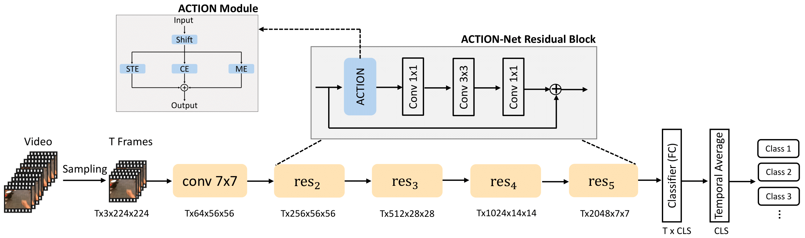
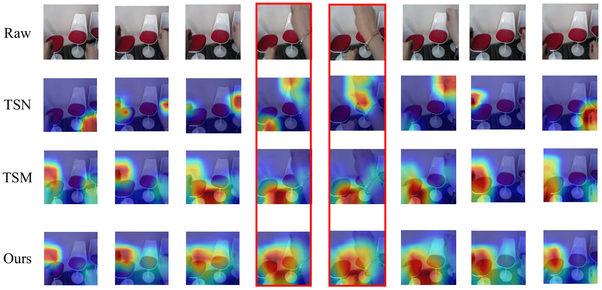

# ACTION-Net
Official implementation of [ACTION-Net: Multipath Excitation for Action Recognition](https://arxiv.org/abs/2103.07372) (CVPR'21)

By [Zhengwei Wang](https://villawang.github.io/), [Qi She](https://qi-she.net/) and [Aljosa Smolic](https://scholar.google.ch/citations?user=HZRejX4AAAAJ&hl=de)

<p align="center"></p>

<p align="center"></p>

## Getting Started
* EgoGesture data folder structure
```
|-frames
|---Subject01
|------Scene1
|---------Color1
|------------rgb1
|---------------000001.jpg
......
|-labels
|---Subject01
|------Scene1
|---------Group1.csv
......
```

* Something-Something V2
```
|-frames
|---1
|------000001.jpg
|------000002.jpg
|------000003.jpg
......
```

* Jester
```
|-frames
|---1
|------000001.jpg
|------000002.jpg
|------000003.jpg
......
```
## Requirements
Provided in the action.Dockerfile

## Annotation files
Annotation files are at this [link](https://www.dropbox.com/sh/hry7o1iri8tebri/AADmotYF-PFY14ueVIdtc1-pa?dl=0). Please follow the annotation files to construct the frame path.

## Usage
```
sh train_ego_8f.sh 0,1,2,3 if you use four gpus
```


## Acknowledgment
Our codes are built based on previous repos [TSN](https://github.com/yjxiong/temporal-segment-networks), [TSM](https://github.com/mit-han-lab/temporal-shift-module) and [TEA](https://github.com/Phoenix1327/tea-action-recognition)

## Pretrained models
Currently, we do not provide the pretrained models since we reconstruct the structure and rename our modules of ACTION for public release. It should be able to get the similar performance indicated in the paper using the codes provided above.

(Update) 

[EgoGesture using 8f](https://www.dropbox.com/sh/v9373sopxmf3vwh/AACDx4E3exxR_gbHgFK7rsGXa?dl=0)

[Jester using 8f](https://www.dropbox.com/sh/77d5qn31wxwpqw8/AAB-1JZVAb1MuQfnOaKtz4Lya?dl=0)

## Citation
If you find our work useful in your research, please cite:
```
@InProceedings{Wang_2021_CVPR,
author = {Wang, Zhengwei and She, Qi and Smolic, Aljosa},
title = {ACTION-Net: Multipath Excitation for Action Recognition},
booktitle = {IEEE/CVF Conference on Computer Vision and Pattern Recognition (CVPR)},
month = {June},
year = {2021}
}
```
